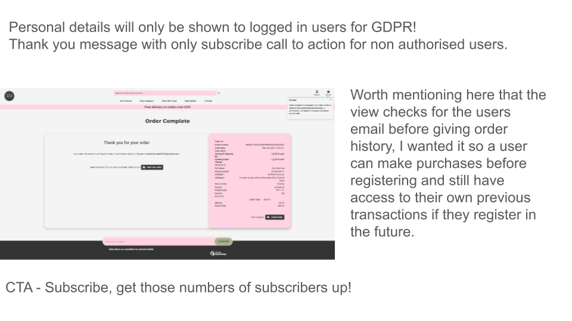
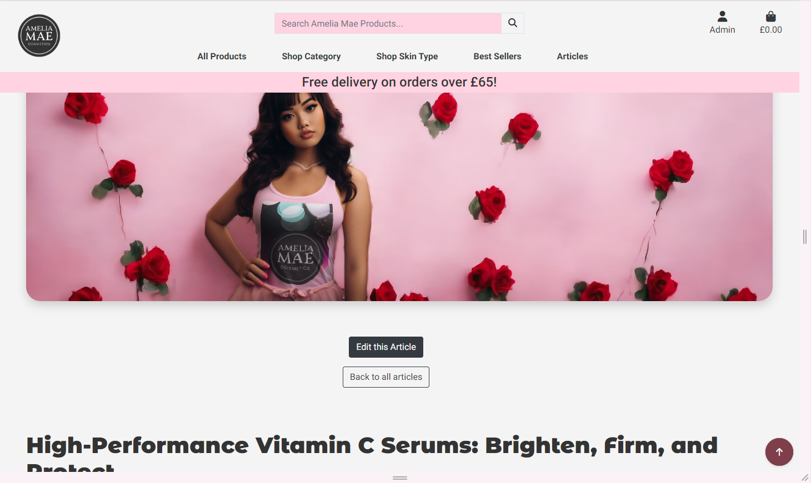

# Amelia Mae Cosmetics  B2C Ecommerce Website

Our website serves both consumers seeking high-quality skincare products from a trusted brand and store owners looking for seamless stock management, article creation, and product management capabilities through the admin login.

## Key Features

- **User Accounts**: Easily create accounts with personal details securely stored.
- **Order History**: Access and review order history for easy reference.
- **Secure Payments**: Make payments securely using Stripe integration.
- **High-Quality Images**: Enjoy high-quality product images for a better shopping experience.
- **Favorites**: Save favorite products for quick access and future purchases.
- **Reviews and Ratings**: Share feedback through reviews and ratings for products.
- **Article Viewing**: Read informative articles on skincare and beauty topics.
- **Admin Control**: Administrators can log in to manage products and articles efficiently.
  - **Product Management**: Create, edit, and delete products easily.
  - **Article Management**: Manage articles with ease, including creation and deletion.
  - **Inventory Tracking**: Track stock sold, lost, and revenue generated.
  - **Stock Management**: Utilize manual and automated processes for stock ordering and receiving.
  - **Inbound Stock Management**: Manage inbound stock deliveries and adjust quantities as needed.

### Website Details

[Git Hub Repo - Amelia Mae Cosmetics](https://github.com/Bowlesy666/amelia-mae-cosmetics)

[Live deployed site - Amelia Mae Cosmetics](https://b2bproject-321684f42c8f.herokuapp.com/)

Want to have a snoop around the admin login functionality? Message me on [my LinkedIn](www.linkedin.com/in/david-bowles-947106216) and i will send over the account details.

Stripe payment system is in development mode, if you wish to try the checkout, please use 4242424242424242...(keep typing 42 till you fill the input box).

___

## Contents

- [Amelia Mae Cosmetics  B2C Ecommerce Website](#amelia-mae-cosmetics--b2c-ecommerce-website)
  - [Key Features](#key-features)
  - [Website Details](#website-details)
  - [Contents](#contents)
  - [UX](#ux)
    - [User Stories](#user-stories)
      - [Target Audience](#target-audience)
      - [Goals](#goals)
      - [Mobile-First Approach](#mobile-first-approach)
  - [Epics \& Their User Stories](#epics--their-user-stories)
      - [User Stories](#user-stories-1)
  - [Design](#design)
    - [WireFrames](#wireframes)
      - [Home page](#home-page)
      - [Product List Page](#bproduct-list-page)
      - [Product Detail Page](#product-detail-page)
      - [Bag And Checkout](#bag-and-checkout)
    - [Colour Scheme](#colour-scheme)
    - [Imagery](#imagery)
    - [Icons](#icons)
  - [Page Flow](#page-flow)
    - [Multipage Website Design](#multipage-website-design)
      - [Referrals and 1-to-1 Meetings Flow](#referrals-and-1-to-1-meetings-flow)
      - [User Profiles Flow](#user-profiles-flow)
    - [Logo and Title](#logo-and-title)
  - [Features](#features)
    - [General Features](#general-features)
    - [General Features](#general-features-1)
    - [Future Implementations](#future-implementations)
    - [Accessibility](#accessibility)
  - [Technology Used](#technology-used)
    - [Languages Used](#languages-used)
    - [Frameworks, Libraries Packages \& Programs Used](#frameworks-libraries-packages--programs-used)
  - [Deployment and local development](#deployment-and-local-development)
    - [Deployment](#deployment)
      - [Pre-Deployment Tasks](#pre-deployment-tasks)
        - [Hidden Variables](#hidden-variables)
      - [Deploying on Heroku](#deploying-on-heroku)
    - [Local development](#local-development)
      - [Run Locally](#run-locally)
      - [How to clone \& Fork](#how-to-clone--fork)
        - [Clone](#clone)
        - [Fork](#fork)
  - [Testing](#testing)
    - [Validators](#validators)
    - [General Testing](#general-testing)
    - [General Testing](#general-testing-1)
    - [Mobile Testing](#mobile-testing)
    - [Desktop Testing](#desktop-testing)
    - [Bugs](#bugs)
      - [Fixed Bugs](#fixed-bugs)
      - [Unfixed](#unfixed)
      - [Goals](#goals-1)
      - [Testing](#testing-1)
  - [Credits](#credits)

___

## UX

### User Stories

#### Target Audience

The target audience for **Amelia Mae Cosmetics** includes:

- **Skincare Enthusiasts Seeking Quality Products:**
  - Individuals looking for high-quality skincare solutions that deliver results.

- **Luxury Beauty Consumers:**
  - Customers who prioritize luxury and elegance in their skincare routine.

- **Health-Conscious Consumers:**
  - Individuals interested in organic and natural skincare products for sensitive skin.

### Goals

The goals for **Amelia Mae Cosmetics** are:

- **Deliver High-Quality Skincare Solutions:**
  - Provide luxurious skincare products that rejuvenate and nourish the skin effectively.

- **Elevate Skincare Experience with Premium Ingredients:**
  - Offer skincare formulations enriched with premium natural ingredients for optimal results.

- **Empower Users with Expert Advice:**
  - Share expert skincare tips and insights through informative blog posts and articles.

- **Personalized Customer Experience:**
  - Offer personalized recommendations and skincare routines tailored to individual needs.

- **Build Trust and Reliability:**
  - Establish a reputation as a reliable and trustworthy brand in the skincare industry.

### Mobile-First Approach

**Amelia Mae Cosmetics** prioritizes a mobile-first approach to ensure seamless browsing and shopping experiences for users, whether they are at home or on the go.

## Epics & Their User Stories

#### User Stories

Please use drop downs to see user stories.

  
Epic: Articles

  <ul>
    <li>As a user, I want to view articles on skincare topics so that I can stay informed and educated about skincare.</li>
    <li>As a user, I want to create articles to share my knowledge and expertise in skincare with others.</li>
    <li>As a user, I want to update articles to ensure that the information provided is accurate and up-to-date.</li>
    <li>As a user, I want to delete articles that are no longer relevant or accurate.</li>
  </ul>

  
Epic: Automated Stock Management

  <ul>
    <li>As a store owner, I want stock levels to be automatically tracked so that I can efficiently manage inventory.</li>
    <li>As a store owner, I want to set reorder thresholds for products to ensure that I never run out of stock.</li>
    <li>As a store owner, I want stock to be automatically replenished when it falls below a certain threshold to avoid stockouts.</li>
    <li>As a store owner, I want to track stock levels to analyze sales trends and forecast future inventory needs.</li>
    <li>As a store owner, I want to log and track referrals for a streamlined process of managing potential revenue opportunities.</li>
    <li>As a store owner, I want to receive email notifications for low stock levels or stock replenishments to stay informed.</li>
    <li>As a store owner, I want to set policies for email notifications and stock management to customize the system according to my preferences.</li>
    <li>As a store owner, I want to automatically generate policies for product returns, refunds, and exchanges to ensure consistency and compliance.</li>
  </ul>

  
Epic: Admin Privileges

  <ul>
    <li>As an admin, I want to add products to the store so that customers have access to a wide range of skincare products.</li>
    <li>As an admin, I want to edit products to update their details or make corrections as needed.</li>
    <li>As an admin, I want to delete products that are discontinued or no longer available for sale.</li>
    <li>As an admin, I want to create, edit, and delete articles to provide valuable content to users and promote engagement.</li>
    <li>As an admin, I want to view user profiles and manage user roles and permissions to ensure platform security and integrity.</li>
    <li>As an admin, I want to generate reports on sales, stock levels, and user activity for data-driven decision-making and business analysis.</li>
  </ul>

  
Epic: Wishlist

  <ul>
    <li>As a user, I want to create a wishlist of skincare products that I'm interested in purchasing in the future.</li>
    <li>As a user, I want to remove items from my wishlist if I change my mind or no longer wish to purchase them.</li>
    <li>As a user, I want to access items from my wishlist directly from my shopping bag for easy checkout.</li>
    <li>As a user, I want to receive email notifications for price drops or promotions on items in my wishlist to take advantage of discounts.</li>
  </ul>

  
Epic: Order Placement

  <ul>
    <li>As a customer, I want to view a summary of my order before finalizing the purchase so that I can review my selections.</li>
    <li>As a customer, I want to input my payment details securely to complete the transaction and make a purchase.</li>
    <li>As a customer, I want to choose shipping details such as shipping address and delivery method to receive my order.</li>
    <li>As a customer, I want to receive a payment confirmation email after successfully placing an order for peace of mind.</li>
    <li>As a customer, I want to track the status of my order and receive updates on its delivery progress for convenience.</li>
  </ul>

  
Epic: User Authentication

  <ul>
    <li>As a user, I want to register for an account to access exclusive features and personalized recommendations.</li>
    <li>As a user, I want to log in to my account securely to view my order history and manage my profile details.</li>
    <li>As a user, I want to update my profile information to keep it accurate and up-to-date.</li>
    <li>As a user, I want to log out of my account to ensure the security of my personal information.</li>
    <li>As a user, I want to receive email notifications for important updates and events, so that I can stay informed and engaged with the platform.</li>
    <li>As a user, I want to be able to update my profile information, so that I can keep my account details accurate and up-to-date.</li>
    <li>As a user, I want the ability to log out of my account securely, so that I can protect my privacy and data.</li>
  </ul>

  
Epic: Product Interaction

  <ul>
    <li>As a user, I want to view detailed product information to make informed decisions about my skincare purchases.</li>
    <li>As a user, I want to search for products by category or keyword to easily find what I'm looking for.</li>
    <li>As a user, I want to add products to my shopping bag and adjust the quantity as needed for a seamless shopping experience.</li>
    <li>As a user, I want to view reviews and ratings from other customers to gauge the effectiveness of skincare products.</li>
    <li>As a user, I want to receive feedback on my shopping bag functionality, so that I can ensure a smooth and intuitive shopping experience.</li>
  </ul>

___

## Design

### WireFrames And Mockups

Please see the below for the wireframes and mockups

#### Home Page

The home page boasts a sleek long-scrolling design, strategically segmented to embody the essence of our brand. From the moment visitors land on the page, they're greeted with distinct sections that portray our identity and resonate with our intended audience.

By leveraging ample white space, each element has a clear purpose, ensuring a seamless user experience. Notably, elements gracefully fade into view, adding a touch of sophistication to the user journey.

As visitors explore, they'll notice the gradual emergence of our brand colors and style, subtly reinforcing our identity and leaving a lasting impression.

#### Product List Page

Our Products List page showcases a thorough selection of offerings, presented elegantly through responsive product cards.

Designed with Bootstrap, the page has a clean and modern aesthetic, ensuring seamless viewing across all devices.

With intuitive navigation options and crisp visuals, customers can effortlessly explore our range and find the perfect products to meet their needs.

#### Product Detail Page

The Product Detail page features a prominent card layout showcasing the product image, accompanied by essential details like description and price. In the image below, the pop up will be visible under the nav bar after products are added to bag.

Below the card, users can conveniently adjust the quantity and add the item to their cart. You will also get a sneak peak here of a future implimentation for the suggested products section(more about that below).

Additionally, there's a dedicated section for ratings and reviews, allowing customers to share feedback and experiences with the product. This design ensures a user-friendly experience across devices and emphasizes the importance of customer feedback in the purchasing process.

#### Bag And Checkout

Throughout the initial planning phase, there have been some refinements in design, particularly concerning the vibrant pink background color, which initially appeared overpowering. However, a decision was made to maintain the brand's signature color while ensuring a more balanced and visually appealing aesthetic. The result is a sleek and impactful design that effectively represents the brand's identity.

### Colour Scheme

The primary color, #ffd3e1, represents vitality, youthfulness, and a sense of luxury, reflecting the essence of the Amelia Mae Cosmetics brand. This soft pink hue, mimi pink, a feminine and elegant appeal to the target audience's desire for high-quality skincare products.

Complementing this main color are the neutral tones of #f4f4f4 and #e0e0e0, which provide a clean and sophisticated backdrop for the website. These shades of gray create a sense of balance and harmony, allowing the main color to stand out while ensuring readability and visual coherence across the site.

The accent colors, #b76e79, #a3b18a, and #333333, add depth and visual interest to the design. The muted rose and sage tones of #b76e79 and #a3b18a complement the main color, adding a touch of warmth and natural beauty. Meanwhile, the dark gray tone of #333333 provides contrast and emphasis, helping to draw attention to important elements such as text and buttons.

Overall, the color palette reflects the brand's commitment to elegance, quality, and sophistication, creating a visually appealing and cohesive website experience for visitors.

Throughout the website, essential information is presented in a clear and contrasting manner.

### Imagery

Imagery plays a pivotal role in enhancing the visual appeal and functionality of the website.

The subtle infusion of "mimi pink" in the background adds a entrancing allure for the end user, providing an delicate yet powerful backdrop for the "white smoke" product cards and nav bar to stand out.

Through the meticulous selection of only two fonts, a sense of cohesion and consistency is maintained across the design, elevating the overall visual experience. The high-quality, vibrant product images serve as a testament to the brand's unwavering commitment to excellence, quality and reliability. 

The product cards are designed to provide comprehensive details in a minimalist format. They show ratings, favourite status, price and a descriptive title. Behind the scenes, automated processes activate when a product reaches a certain sales threshold, earning it the prestigious 'Best Seller' badge.

Additionally, items with low stock or those that have been discontinued are marked with a distinctive ribbon indicating the remaining quantities. When a product is out of stock, an overlay is displayed, and the quantity input is disabled with a button clearly indicating the stock status. These features are carefully managed in the view to prevent users from adding more quantity than available, even if they attempt to bypass the template.

The product images were crafted using two platforms: [photoroom](https://app.photoroom.com/) and [place-it](https://placeit.net/).

Initially, product labels were designed in Photoroom, then integrated onto the products using Placeit. The final product was then passed back into Photoroom for finishing touches. 

Additionally, the models featured on the website are sourced from Placeit and are AI-generated female models. Utilizing the free trials available on both platforms, I was able to complete this project without any cost implications. 

(Note: The specific model used in the main jumbotron image of the home page will be referenced below.)

The overall imagery of the forward facing site is there to convey reliability and gain the end users trust ultimately awarding us with sales.

The store owner or staff login interface exudes professionalism while maintaining the consistent color scheme of Amelia Mae Cosmetics, ensuring users feel grounded within the brand's environment.

The main admin activity panel optimally utilizes white space and intuitive icons, facilitating seamless navigation. Within each section, users can effortlessly perform actions such as creating, viewing, updating, and deleting products, articles, and inventory items.

Stock management functionality offers comprehensive CRUD operations, empowering users with features like total profit analysis, automated and manual stock ordering, receipt of supplier deliveries, and efficient stock level updates along with threshold control. With a holistic approach catering to both store owners and end-users, this website is designed to meet diverse needs effectively. the admin activities also have their own custom search and sort functionality so they can serach within the inventory fields.

The store owner or staff login shows your down to business while still keeping the same colour scheme so you know you are still at Amelia Mae Cosmetics. the main admin activity panel makes good use of white space and icons, going into each section is where you can create, view, update and delete products, articles and inventory items. stock management allows full CRUD including analysis of total profit generated, automated and manual ordering of stock, taking in deliveries from suppliers and updating stock levels ad controlling thresholds. This is an all round website with the store owner and end user in mind.

### Icons

Icons used are fontawesome, from the favourites heart to the admin activity panel, font awesome is well utilised throughout the site.

___

## Page Flow

### Multi Page Website Design

Embracing a multipage design, our website ensures a user-friendly journey throughout, offering distinct pages for various functionalities of the end user and the store owner. The approach aims to utilise white space and minimalist feel while giving as much detail as needed to enhance the brand, create a sense of trustworthyness and security.

Each page has clear functionalities with data security being the driving force, fostering a focused user experience and enabling efficient communication of key concepts. Additionally, the multipage structure facilitates future scalability, providing a foundation for seamless expansion and incorporation of new features as the platform evolves.

#### Home Page

Index page utilises a long flow with bold imagery, really setting the scene for the shopper.

#### Buying Products Flow

Very intuitive shopping style, quick add from all products page, add quantities from detail and bag pages and checkout. the search functionality has drop downs and uses the search bar at the top in pink.

#### Search flow

The shopper has very similar search and sort to the boutique ado we have all seen, I wanted to go a bit further and got my teeth into it customising it further for the inventory side.

#### User Authetication

User authentication pages all use the same base style as the below with the image displaying on larger screen sizes only.

During authentication process, the user registers with their email address amd is sent a verification email that redirect them back to the site where they will verify their account.

The logged in user can also see order history and amend their profile informatiom on the same cards. Order history will only show if the user is logged in, if any one tries to access this via the url, the view provides an empty order so no details can be passed or manipulated with malicious intent.

#### Favourites And Reviews

##### Favourites

The favourites flow is simple and effective, the view will handle if a person is logged in to be able to favourite a product and returns toasts success or error with a clear message and visual cue of full heart for favourited and outline for not. Favourites cards are collected in the shopping bag, and have a dedicated template where a registered user can find all their favourites in one place.

##### Reviews

Authorised users can leave reviews and give ratings in stars 1 to 5, again the view handles user authentication and validity, we also eliminate the changes of a user trying to leave reviews by using template logic.

The view handles the logic behind the reviews overview and returns a string style="width: 'var'%" which renders the progress bar for each stars count. this also respends accordingly when a review is deleted.

#### Articles

Full CRUD!

Admin users can create, edit, delete articles with the main image set as a hero image.

There is a custom serach and sort for the articles as again they are on a new model.

The articles are able to be refreshed and updated by the store owner and helps keep everything up to date regarding SEO.

#### Admin Activity

Admin activity is something I wanted to really develop, there are many features I would like to add but will have to wait for future sprints.

The flow here solves many business problems, I wanted a user friendly platform so a store owner can reduce, if not, eliminiate some tasks.

We have full crud on products, Articles and inventory items, ability to automate stock replenishment and send manual stock orders aswell as check stock quantities inbound before allowing quantities into the store, yet to develop is an order picking system attached to it that can return and print address labels making this an all in one solution. Theres is lots of potential here for analytics and I have started to touch base with the total revenue, which works out the difference between stock cost and product sales but well worth expanding on.

### Logo and Title

Logo was well designed so it can fit in circular avatars and be easily recognised, originally I wanted it in gold but it didnt seem to fit well with the other colours I wanted.

The title 'Amelia Mae Cosmetics' is not just a made up brand(well it is at the moment) but this is something i would like to develop and market. I have foud this project fun, exciting and has spurred me on to go further with the brand itself.

Fonts are also Lato and Monserrat, the lato is sleek and fits well in all situations. Monserrat I chose this as it shows a fun side and stands out.

___

## Features

